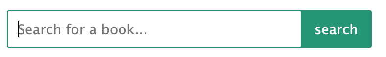

# SQL Library Manager
A front-facing webpage to interact with a sample library database

## Highlighted Features
This project was developed using Node.js, Express, Pug.js, Sequelize, JavaScript, HTML, and CSS.

### Add, Update, and Delete
This webpage allows users to add newbook entries, update existing books, and delete entries.

### Validation
Data will not be submitted to the database if the user does not supply adequete information. Warnings are displayed once the user tries to submit data if the requirements are not met. A helpful hint will show what information is missing.

### Search
Users are able to search the database by entering a keyword (or keywords) in the search bar. This string will be compared to data in each of the columns of data. Searching for an author's name or a genre is an easy way to filter the list.

*Note: the search will always look for data in each column, it will not be restricted to a certain column or type of data.*

### Pagination
When data is requested from the database and displayed on the page, entries will be limited to 7 items per page. Navigation arrows and page numbers are displayed below the data, and the current page is converted from a `<a>` tag into a `<p>` tag so as not to allow the user to reload the current page with the navigation bar.

The page numbers are generated in the `books.pug` layout file, and then the rest of the functionality, such as the navigation arrows are added in the `nav.js` file which is served from the static 'public' folder.

I was very proud of this `JavaScript` code block to generate the navigation arrows:
```JavaScript
// button for navigating one page back
if (parseInt(page) === 1 || !page) {
    navBlock[0].insertAdjacentHTML('afterbegin', '<p><</p>');
} else {
    navBlock[0].insertAdjacentHTML('afterbegin', navBackHTML);
};

// button for navigating one page forward
if (parseInt(page) === parseInt(nav[nav.length-1].innerText)) {
    navBlock[0].insertAdjacentHTML('beforeend', '<p>></p>');
} else {
    navBlock[0].insertAdjacentHTML('beforeend', navForwardHTML);
};
```
### Styling
The primary focus of styling in this project was to make navigation clear. The navigation button that represents the page of data currently being displayed will be highlighted in a different color than the other buttons. When the user reaches either the last page or the first page, the arrow button that would navigate to a non-existent page will be disabled and appear faded.

One design feature I really like is the search bar. The input element and the button appear as one continuous element. See image:



## Thank you!
As always, comments and criticism are both welcomed and encouraged. Thanks for taking the time to look at this project.

Cheers!